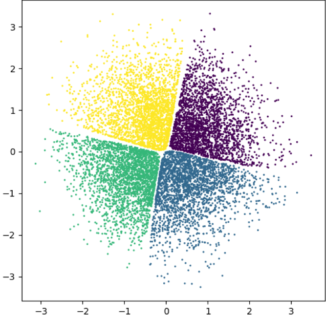
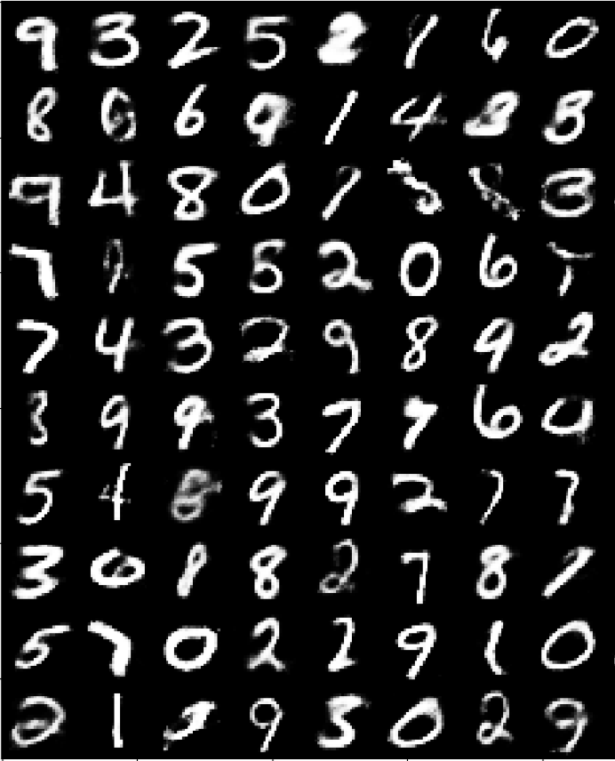

[Adversarial Variational Bayes](https://arxiv.org/abs/1701.04722) [1] 
=========

## Description

An implementation of Adversarial Variational Bayes Autoencoder (as per [1]) using Keras with TensorFlow as backend.
The code reproduces the generative experiments from the paper (synthetic dataset and MNIST) and was written 
as part of a Deep Learning lab course at TUM.

Check out also the original AVB repository: https://github.com/LMescheder/AdversarialVariationalBayes 

## Requirements

The code for training and testing the models is compatible with Python 2, however, for metric evaluation only 
Python 3 will interpret the third-party ITE package. Hence it is strongly recommended that you configure a 
Python 3 interpreter. Please refer to the `requirements.txt` for a working package versions.

Note: for running the code on GPU, you will have to change the `tensorflow` requirement to `tensorflow-gpu`.

## Implementation details

add details

## Results

These are some examples of the reproduced experiments on the latent space of the 4-points synthetic dataset
and random generated samples trained on the binarized MNIST dataset. Both examples use AVB without AC. More 
images are coming soon.

## Acknowledgements
Many thanks to Maximilian Karl for the fruitful discussions and the invaluable advice.
This implementation makes use of the [ITE](https://bitbucket.org/szzoli/ite/) package by Zoltán Szabó.

## References
[1]: 
Mescheder, Lars, Sebastian Nowozin, and Andreas Geiger. 
"Adversarial variational bayes: Unifying variational autoencoders and generative adversarial networks." 
arXiv preprint arXiv:1701.04722 (2017).
